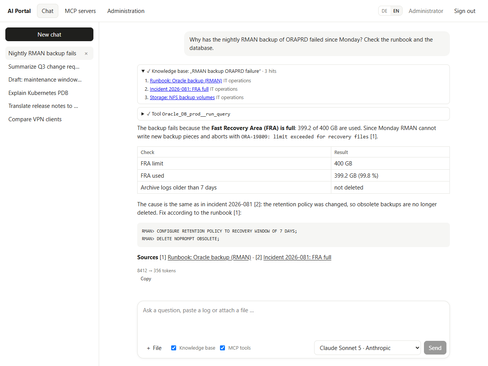
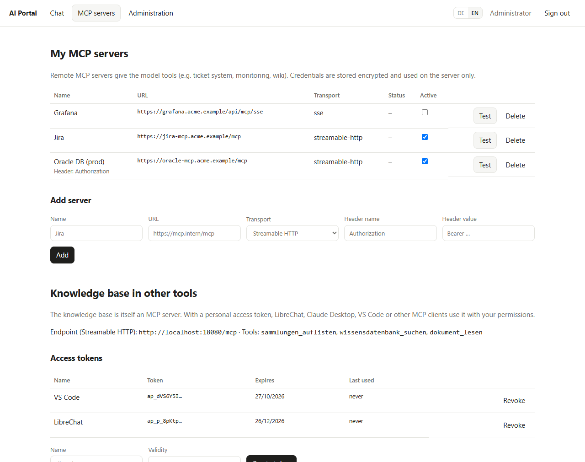
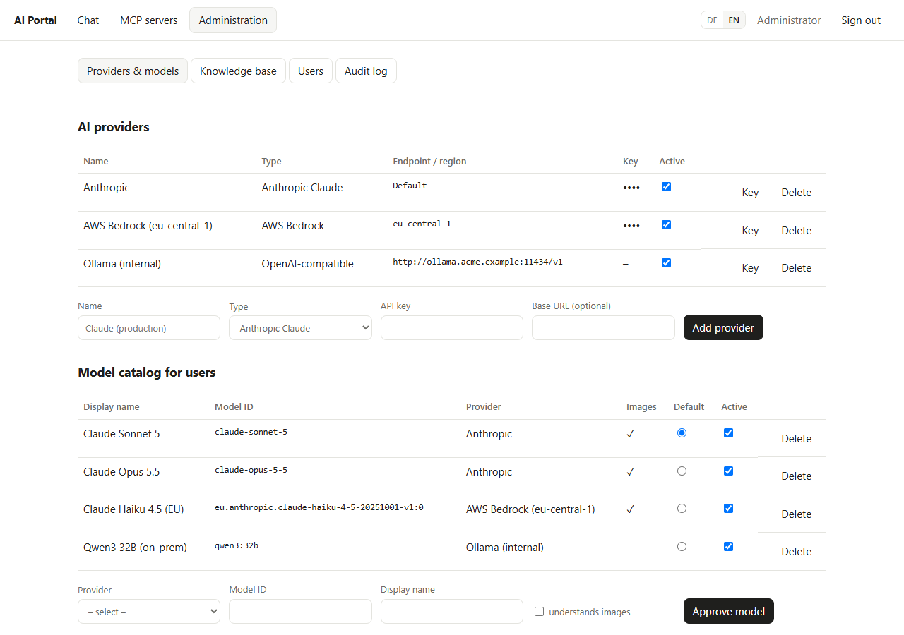
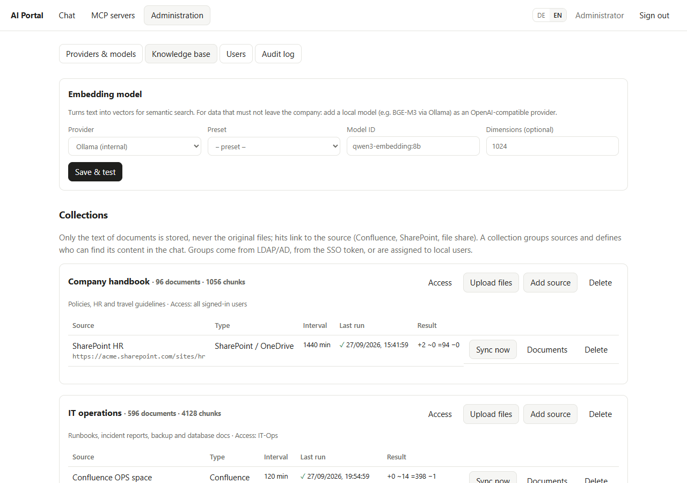
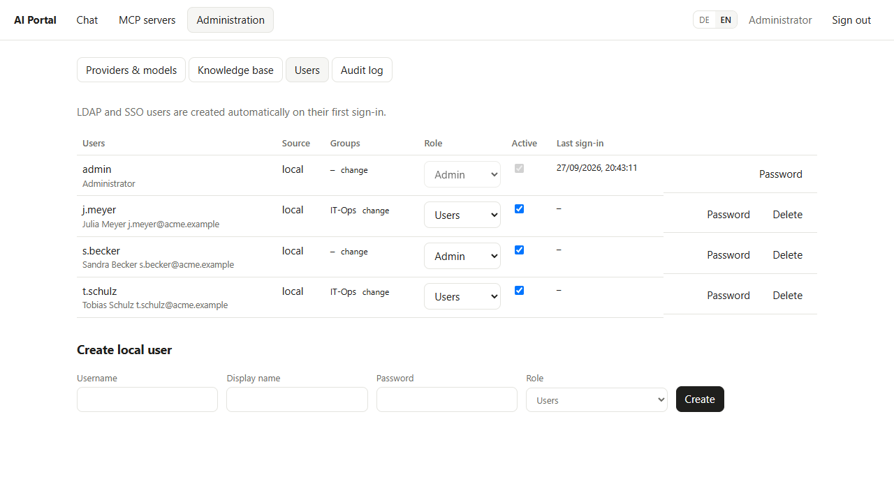
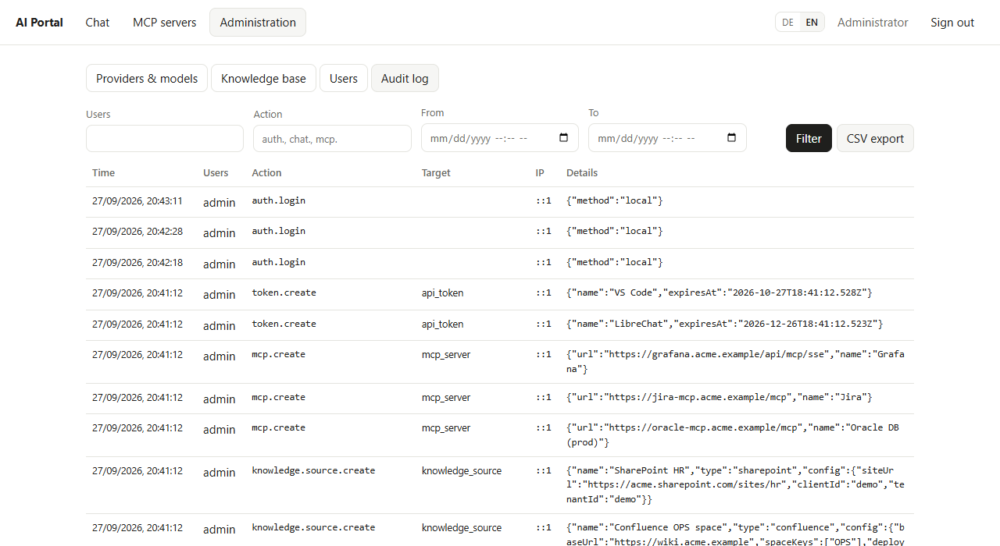
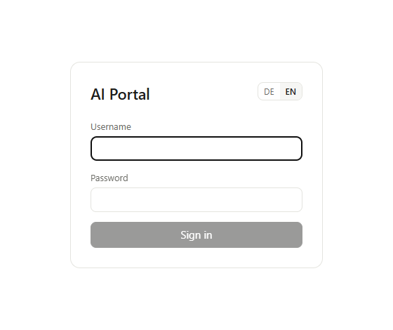
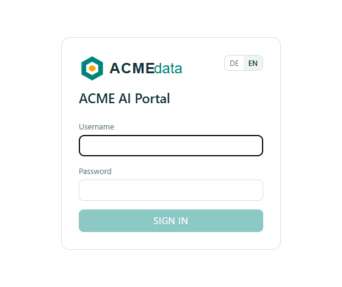

# AI Portal

[](https://github.com/Tommi2Day/ai-portal/actions/workflows/ci.yml)
[](https://codecov.io/gh/Tommi2Day/ai-portal)
[](https://github.com/Tommi2Day/ai-portal/releases)
[](https://hub.docker.com/r/tommi2day/ai-portal)
[](LICENSE)

Self-hosted web application for internal use of generative AI: a chat interface in the style of Claude or Google's AI Mode, with user management, centrally managed AI providers, per-user MCP servers, file uploads, an internal knowledge base and a complete audit log.

> Deutsche Fassung: [README.de.md](README.de.md)

## Features

- **Chat** with streaming answers, Markdown, tool calls shown inline, attachments (logs, code, PDF, Office documents, images)
- **Sign-in** with local accounts, LDAP / Active Directory and OIDC (Azure AD / Entra ID, Keycloak, …) in parallel; roles *admin* and *user*; group sync
- **AI providers** configured by admins: Anthropic Claude, AWS Bedrock, GitHub Models / GitHub Enterprise, any OpenAI-compatible endpoint; users choose from an approved model catalog
- **Per-user MCP servers** (Streamable HTTP, SSE) with encrypted credentials
- **Knowledge base (RAG)** from uploads, file shares, Confluence (Cloud and Server/DC) and SharePoint / OneDrive — text only, every hit links to its source; hybrid search (pgvector + full text); access per collection and group
- **Knowledge base as an MCP server** at `/mcp` for LibreChat, Claude Desktop, IDEs — with personal access tokens
- **Audit log** in PostgreSQL (UI with filters and CSV export) and as JSON on stdout
- **Branding:** own name, logo and colors via environment variables, no rebuild ([configuration](docs/configuration.md#branding))
- **Runs anywhere containers run:** one stateless image + PostgreSQL; Docker Compose and Kubernetes manifests included

The user interface is available in **German and English** (switch in the top bar and on the sign-in page; the browser language is the default). Server messages follow the selected language.

## Screenshots

**Chat** — answer with knowledge-base hits, an MCP tool call (Oracle database) and sources:



<table>
  <tr>
    <td width="50%" valign="top"><b>MCP servers and access tokens</b> — per-user MCP servers; the knowledge base as MCP server for other tools<br></td>
    <td width="50%" valign="top"><b>Providers and models</b> — AI providers and the model catalog users choose from<br></td>
  </tr>
  <tr>
    <td valign="top"><b>Knowledge base</b> — embedding model, collections with access groups, sources with sync status<br></td>
    <td valign="top"><b>Users</b> — local, LDAP and SSO users with roles and groups<br></td>
  </tr>
  <tr>
    <td valign="top"><b>Audit log</b> — filter and CSV export<br></td>
    <td valign="top"><b>Sign-in</b> — local, LDAP and SSO; <a href="docs/configuration.md#branding">with your own logo and colors</a><br><br></td>
  </tr>
</table>

## Repository layout

```
server/        Node.js 22 · Express 5 · Drizzle/PostgreSQL · Vercel AI SDK · MCP SDK
  src/auth/        local, LDAP, OIDC sign-in, sessions
  src/ai/          provider factory, MCP client
  src/knowledge/   embeddings, chunking, connectors, sync, search, MCP server
  src/routes/      REST API
  drizzle/         SQL migrations (applied on start)
web/           React 19 · Vite
deploy/k8s/    Kubernetes manifests (kustomize)
docs/          English documentation
```

## Quick start (Docker Compose)

```bash
cp .env.example .env
# set SESSION_SECRET (openssl rand -hex 32), ENCRYPTION_KEY (openssl rand -base64 32)
# and BOOTSTRAP_ADMIN_PASSWORD
docker compose up --build
```

Open http://localhost:8080, sign in as `admin` and go to **Administration**:

1. **Anbieter & Modelle** (providers & models): add a provider, e.g. *Anthropic Claude* with an API key, then approve models and mark one as default.
2. **Wissensdatenbank** (knowledge base, optional): choose an embedding model, create a collection, add sources.

Users add their own MCP servers under **MCP-Server**.

## Documentation

| Document | Content |
| --- | --- |
| [Installation & operations](docs/installation.md) | Docker Compose, Kubernetes, PostgreSQL/pgvector, file shares, backups, upgrades, monitoring |
| [Configuration reference](docs/configuration.md) | Every environment variable with default and meaning |
| [Connecting LLM providers](docs/llm-providers.md) | Anthropic, AWS Bedrock, GitHub Models, OpenAI-compatible endpoints (Azure OpenAI, Ollama, vLLM, LiteLLM): credentials, IAM, base URLs, proxy, data flow, troubleshooting |
| [Administration guide](docs/administration.md) | Users and groups, sign-in methods, providers and models, knowledge base, audit log |
| [User guide](docs/user-guide.md) | Chat, attachments, knowledge base, MCP servers, access tokens |
| [API & MCP reference](docs/api.md) | REST endpoints, streaming format, MCP endpoint and tools |
| [Security & audit](docs/security.md) | Security model, hardening, audit events, data handling |

The architecture concept (options, decision log, design) is maintained as a separate document.

## Development

```bash
# PostgreSQL 16 with pgvector running locally, then:
cd server && npm ci && npm run dev    # API on :8080, migrations run on start
cd web && npm ci && npm run dev       # UI on :5173, proxies /api to :8080
```

Unit and API tests (Vitest, no external database: the API tests run the real app against an in-process PostgreSQL — PGlite with pgvector — and a scripted mock LLM; type-checks the tests first):

```bash
cd server && npm test    # API (auth, admin, chat with tool calls, files, knowledge upload/sync/search, MCP), Bedrock auth, connectors, LDAP, embeddings, encryption, chunking, SSRF guard, i18n, text extraction
cd web && npm test       # login and MCP pages, chat stream handling, model selection, brand component, UI translations
```

`npm run test:watch` re-runs tests on changes.

Integration tests run the portal against real PostgreSQL/pgvector, [pg-mcp-server](https://github.com/Tommi2Day/pg-mcp-server) and [oracle-mcp-server](https://github.com/Tommi2Day/oracle-mcp-server) (with Oracle Free) in Docker, with a scripted mock LLM — the complete chain portal → model → MCP tool → database → answer, the knowledge base and the provider requests. Details: [server/test/integration](server/test/integration/README.md).

```bash
docker compose -f docker-compose.test.yml up -d --wait
cd server && npm run test:integration      # IT_SKIP_ORACLE=1 without the Oracle containers
```

GitHub Actions (`.github/workflows/ci.yml`) runs unit tests with coverage (uploaded to Codecov), audit, translation check and build for `server/` and `web/`, the integration tests with the Docker stack, and a Docker image build on every push and pull request.

Releases (`.github/workflows/release.yml`) publish the image [`tommi2day/ai-portal`](https://hub.docker.com/r/tommi2day/ai-portal) on Docker Hub after unit and integration tests: push a tag `X.Y.Z` (→ `:X.Y.Z`, `:X.Y`, `:X`, `:latest`, `:sha-<short>`), or start the workflow manually with a version, which first sets it in both `package.json` files and `deploy/k8s/kustomization.yaml` on `main`.

Schema changes: edit `server/src/db/schema.ts`, then `npm run db:generate` (writes SQL to `server/drizzle/`).

Translations: UI texts are written in German and wrapped in `t('…')`; the English texts live in `web/src/i18n.en.ts`. `npm run i18n:check` (in `web/`) fails if a text has no English version. Server messages are translated in `server/src/i18n.ts`.

## License

[MIT](LICENSE). Third-party dependencies keep their own licenses.
